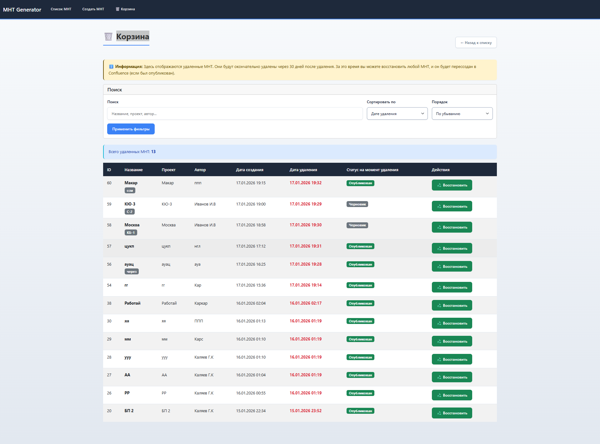

# МНТ Confluence Generator

> Веб-приложение для генерации и публикации документов МНТ (Методика Нагрузочного Тестирования) в Confluence из удобной веб-формы.


**Автор:** [GeorgeKalyaev](https://github.com/GeorgeKalyaev)

## 📋 Описание

МНТ Confluence Generator — это инструмент для создания структурированных документов МНТ с возможностью публикации в Confluence. Приложение предоставляет интуитивно понятный веб-интерфейс с визуальными редакторами таблиц, автоматическим форматированием и интеграцией с Confluence API.

## 🖼️ Скриншоты проекта

<details>
<summary><b>Нажмите, чтобы просмотреть скриншоты интерфейса</b></summary>

### Главная страница - Список МНТ

*Главная страница со списком всех документов МНТ, возможностью поиска, фильтрации и сортировки.*

### Форма создания МНТ

*Веб-форма для создания нового документа МНТ с визуальными редакторами таблиц.*

### Публикация в Confluence

*Процесс публикации документа в Confluence с указанием Space Key и родительской страницы.*

### История версий МНТ

*Интерфейс просмотра истории версий документа с возможностью сравнения и восстановления версий.*

### Сравнение версий МНТ

*Визуальное сравнение двух версий документа с выделением изменений.*

### Корзина

*Интерфейс корзины для восстановления удаленных документов МНТ.*

</details>

---

## ✨ Основные возможности

| Возможность | Описание |
|------------|----------|
| 📝 **Создание и редактирование МНТ** | Удобный веб-интерфейс для работы с документами |
| 📊 **Визуальные редакторы таблиц** | Интерактивные таблицы для всех разделов документа с поддержкой drag & drop |
| 🏷️ **Система тегов** | Категоризация документов (например, названия команд, проекты) |
| 🔄 **Публикация в Confluence** | Ручная публикация документов в Confluence Cloud или Server/Datacenter |
| 📋 **Управление документами** | Полнофункциональный список с поиском, фильтрацией и сортировкой |
| 🗑️ **Корзина** | Мягкое удаление с возможностью восстановления документов |
| 📤 **Экспорт** | Экспорт документов в HTML и текстовый формат |
| 📝 **История версий** | Версионирование документов с возможностью сравнения и восстановления |
| 📊 **История действий** | Подробное логирование всех действий пользователей |
| 🔒 **Защита данных** | Защита от потери данных при недоступном Confluence |
| ✅ **Проверка полноты** | Индикатор прогресса заполнения документа |
| 🔍 **Автодополнение** | Автодополнение для полей проекта, автора и тегов |

## 🛠️ Технологии

- **Backend**: FastAPI (Python 3.10+)
- **База данных**: PostgreSQL 12+
- **UI**: HTML5 + Bootstrap 5 + Jinja2 Templates
- **Интеграция**: Confluence REST API (Cloud и Server/Datacenter)
- **Логирование**: Расширенная система с поддержкой JSON формата для ELK

## 📦 Требования

### Минимальные требования

- **Python** 3.10 или новее
- **PostgreSQL** 12 или новее
- **Оперативная память** 512 MB (рекомендуется 1 GB)
- **Дисковое пространство** 100 MB (без учета базы данных)

### Опциональные требования

- **Confluence** (Cloud или Server/Datacenter) - для публикации документов
- **Docker** 20.10+ и **Docker Compose** 2.0+ - для контейнеризованного развертывания

## 🚀 Быстрый старт

### Вариант 1: Docker Compose (рекомендуется для production)

Для быстрого развертывания в корпоративной среде:

```bash
# 1. Клонируйте репозиторий
git clone https://github.com/GeorgeKalyaev/mnt-confluence-generator-public.git
cd mnt-confluence-generator

# 2. Настройте .env файл (см. раздел "Настройка конфигурации" ниже)

# 3. Запустите все сервисы одной командой
docker-compose -f docker-compose.full.yml up -d
```

Приложение будет доступно на http://localhost:8000  
База данных PostgreSQL будет создана и инициализирована автоматически.

📖 **Подробная инструкция для DevOps:** [docs/DEPLOY.md](docs/DEPLOY.md)

---

### Вариант 2: Ручная установка

#### 1. Клонирование репозитория

```bash
git clone https://github.com/GeorgeKalyaev/mnt-confluence-generator-public.git
cd mnt-confluence-generator
```

#### 2. Установка зависимостей

```bash
pip install -r requirements.txt
```

#### 3. Настройка базы данных PostgreSQL

#### 3.1. Создание базы данных

Откройте **pgAdmin** или используйте командную строку:

**Через pgAdmin:**
1. Откройте pgAdmin
2. Подключитесь к серверу PostgreSQL
3. Правый клик на "Databases" → "Create" → "Database"
4. Имя базы данных: `mnt_db`
5. Нажмите "Save"

**Через командную строку:**
```bash
psql -U postgres
CREATE DATABASE mnt_db;
\q
```

#### 3.2. Импорт схемы базы данных

**Через pgAdmin:**
1. Выберите созданную базу данных `mnt_db`
2. Откройте "Query Tool" (правый клик → "Query Tool")
3. Откройте файл `database/schema.sql` в редакторе
4. Скопируйте весь содержимое файла
5. Вставьте в Query Tool
6. Нажмите "Execute" (F5)

**Через командную строку:**
```bash
psql -U postgres -d mnt_db -f database/schema.sql
```

**Что создается при выполнении schema.sql:**
- Схема `mnt` в базе данных
- Таблица `mnt.documents` для хранения документов МНТ (включая поддержку soft delete)
- Таблица `mnt.action_history` для истории действий пользователей
- Таблица `mnt.document_versions` для версионирования документов
- Таблица `mnt.field_history` для истории изменений отдельных полей
- Таблицы `mnt.tags` и `mnt.document_tags` для управления тегами
- Все необходимые индексы для оптимизации производительности (включая GIN индексы для JSONB)
- Триггеры для автоматического обновления временных меток
- Комментарии к таблицам и полям

**Важно:** Скрипт `schema.sql` содержит **ВСЕ** необходимые таблицы для работы приложения. Дополнительные миграции (`add_versions_table.sql`, `add_field_history_table.sql`) уже включены в основной скрипт.

#### 4. Настройка конфигурации

Создайте файл `.env` в корне проекта на основе примера:

```env
# ============================================
# Database Configuration
# ============================================
DATABASE_HOST=localhost
DATABASE_PORT=5432
DATABASE_NAME=mnt_db
DATABASE_USER=postgres
DATABASE_PASSWORD=ваш_пароль_postgres

# ============================================
# Confluence Configuration
# ============================================
# Для Confluence Cloud:
CONFLUENCE_URL=https://your-company.atlassian.net
CONFLUENCE_EMAIL=your-email@example.com
CONFLUENCE_API_TOKEN=your-api-token

# ИЛИ для Confluence Server/Datacenter:
# CONFLUENCE_URL=http://localhost:8090
# CONFLUENCE_USERNAME=admin
# CONFLUENCE_PASSWORD=admin

# ============================================
# Logging Configuration
# ============================================
# Уровень логирования: TRACE, DEBUG, INFO, WARNING, ERROR, CRITICAL
LOG_LEVEL=INFO

# Формат логов: "text" или "json" (для ELK)
LOG_FORMAT=text

# Название сервиса (для идентификации в системах мониторинга/ELK)
LOG_SERVICE_NAME=mnt-confluence-generator

# Окружение: development, staging, production
LOG_ENVIRONMENT=development

# Максимальный размер лог-файла в МБ
LOG_FILE_MAX_SIZE_MB=100

# Количество резервных копий лог-файлов
LOG_FILE_BACKUP_COUNT=5

# Включить логирование в файл (true/false)
LOG_ENABLE_FILE=true

# Включить логирование в консоль (true/false)
LOG_ENABLE_CONSOLE=true
```

**Важно:** Замените значения на ваши реальные данные:
- `DATABASE_PASSWORD` - пароль пользователя PostgreSQL
- `CONFLUENCE_URL` - URL вашего Confluence
- `CONFLUENCE_EMAIL` и `CONFLUENCE_API_TOKEN` (для Cloud) или `CONFLUENCE_USERNAME` и `CONFLUENCE_PASSWORD` (для Server)

#### 5. Запуск приложения

```bash
python -m uvicorn app.main:app --reload --host 0.0.0.0 --port 8000
```

После запуска вы увидите:
```
INFO:     Uvicorn running on http://0.0.0.0:8000 (Press CTRL+C to quit)
INFO:     Started reloader process
INFO:     Started server process
INFO:     Waiting for application startup.
INFO:     Application startup complete.
```

#### 6. Открытие в браузере

Откройте браузер и перейдите по адресу:
- http://localhost:8000
- или http://127.0.0.1:8000

## 📖 Подробная документация

Все документы находятся в папке [`docs/`](docs/):

- **[docs/INSTALL.md](docs/INSTALL.md)** - Подробная инструкция по установке
- **[docs/QUICKSTART.md](docs/QUICKSTART.md)** - Быстрый старт для опытных пользователей
- **[docs/LOGGING.md](docs/LOGGING.md)** - Документация по системе логирования
- **[docs/QUICK_START_CONFLUENCE.md](docs/QUICK_START_CONFLUENCE.md)** - Быстрый старт Confluence через Docker
- **[docs/DOCKER_SETUP.md](docs/DOCKER_SETUP.md)** - Установка Docker для Confluence
- **[docs/DOCKER_TROUBLESHOOT.md](docs/DOCKER_TROUBLESHOOT.md)** - Решение проблем с Docker
- **[docs/GET_SERVER_LICENSE.md](docs/GET_SERVER_LICENSE.md)** - Получение лицензии для Confluence Server
- **[docs/DRAG_DROP_AUTOCOMPLETE_IMPLEMENTATION.md](docs/DRAG_DROP_AUTOCOMPLETE_IMPLEMENTATION.md)** - Документация по функционалу Drag & Drop и автодополнения
- **[docs/OFFLINE_DEPENDENCIES.md](docs/OFFLINE_DEPENDENCIES.md)** - Работа с оффлайн зависимостями
- **[docs/DEPLOY.md](docs/DEPLOY.md)** - Инструкция по развертыванию для DevOps (Docker Compose, systemd, production)

## 🗂️ Структура проекта

```
mnt-confluence-generator/
├── app/                          # Основной код приложения
│   ├── main.py                   # Точка входа FastAPI, маршруты
│   ├── models.py                 # Pydantic модели данных
│   ├── database.py               # Подключение к PostgreSQL
│   ├── db_operations.py          # Операции с базой данных
│   ├── confluence.py             # Интеграция с Confluence API
│   ├── render.py                 # Генерация контента для Confluence
│   ├── logger.py                 # Система логирования
│   ├── config.py                 # Конфигурация приложения
│   ├── defaults.py               # Значения по умолчанию для форм
│   ├── templates/                # HTML шаблоны (Jinja2)
│   │   ├── base.html
│   │   ├── create.html           # Форма создания МНТ
│   │   ├── edit.html             # Форма редактирования МНТ
│   │   ├── list.html             # Список МНТ
│   │   └── trash.html            # Корзина
│   └── static/                   # Статические файлы
│       ├── js/                   # JavaScript файлы
│       └── images/               # Изображения
├── database/
│   ├── schema.sql                # SQL схема базы данных ⚠️ ВЫПОЛНИТЬ ПРИ УСТАНОВКЕ
│   ├── add_versions_table.sql    # Миграция версий (включена в schema.sql)
│   └── add_field_history_table.sql # Миграция истории полей (включена в schema.sql)
├── docs/                         # Документация
│   ├── DEPLOY.md                 # Инструкция для DevOps
│   ├── INSTALL.md                # Подробная инструкция по установке
│   └── screenshots/              # Скриншоты интерфейса
├── logs/                         # Логи приложения (создается автоматически)
├── Dockerfile                    # Docker образ приложения
├── docker-compose.full.yml       # Docker Compose для полного стека
├── .env                          # Конфигурация (создать на основе примера)
├── requirements.txt              # Зависимости Python
└── README.md                     # Этот файл
```

## 💾 База данных

### Структура базы данных

При выполнении `database/schema.sql` создаются:

1. **Схема `mnt`** - изолированное пространство имен для всех объектов

2. **Таблица `mnt.documents`** - основная таблица для хранения документов МНТ:
   - `id` - уникальный идентификатор
   - `title`, `project`, `author` - основные поля
   - `data_json` (JSONB) - все данные формы в структурированном виде
   - `status` - статус документа (draft, published, error)
   - `confluence_*` - информация о публикации в Confluence
   - `deleted_at` - метка мягкого удаления
   - `created_at`, `updated_at` - временные метки

3. **Таблица `mnt.action_history`** - история действий пользователей:
   - `mnt_id` - ссылка на документ
   - `user_name` - имя пользователя
   - `action_type` - тип действия (created, updated, published, deleted)
   - `action_description` - описание действия
   - `details` (JSONB) - дополнительные детали
   - `created_at` - время действия

4. **Индексы** для оптимизации производительности:
   - Поиск по статусу, проекту, автору
   - Фильтрация по deleted_at (soft delete)
   - Сортировка по created_at, updated_at
   - Поиск по JSONB содержимому (теги, содержимое)
   - Составные индексы для частых запросов

5. **Триггеры**:
   - Автоматическое обновление `updated_at` при изменении записи

### Важно при установке

⚠️ **Обязательно выполните `database/schema.sql` в созданной базе данных `mnt_db`!**

Без выполнения этого скрипта приложение не сможет работать, так как таблицы и индексы не будут созданы.

## 🔧 Использование

### Создание нового МНТ

1. Откройте http://localhost:8000/mnt/create
2. Заполните все обязательные поля формы
3. Используйте визуальные редакторы таблиц для заполнения разделов
4. Добавьте теги для категоризации (через запятую)
5. Укажите Space Key в Confluence (если планируете публикацию)
6. Нажмите "Сохранить и сгенерировать в Confluence" или "Сохранить как черновик"

### Редактирование МНТ

1. Откройте список МНТ: http://localhost:8000/mnt/list
2. Нажмите "Редактировать" у нужного документа
3. Внесите изменения
4. Сохраните изменения

### Публикация в Confluence

Публикация в Confluence происходит **вручную** по нажатию кнопки:

1. При создании или редактировании выберите кнопку **"Сохранить и сгенерировать в Confluence"** или **"Сохранить и обновить в Confluence"**
2. Укажите Space Key (например, "TEST")
3. Опционально укажите Parent Page ID для создания подстраницы
4. После успешной публикации вы получите ссылку на страницу в Confluence

**Важно:** Публикация происходит только при явном нажатии кнопки. Документы можно сохранять как черновики без публикации в Confluence.

### Управление документами

- **Поиск**: Используйте поле поиска в списке МНТ
- **Фильтрация**: По статусу, автору, тегам
- **Сортировка**: По дате создания, обновления, названию
- **Удаление**: Документы перемещаются в корзину (soft delete)
- **Восстановление**: Из корзины можно восстановить удаленные документы

## 🔐 Безопасность

- **Защита от потери данных**: Удаление МНТ с опубликованной страницей блокируется, если Confluence недоступен
- **Мягкое удаление**: Документы не удаляются физически, а помечаются как удаленные
- **Логирование**: Все действия пользователей логируются с контекстом

## 📊 Логирование

Приложение использует расширенную систему логирования:

- **Уровни**: TRACE, DEBUG, INFO, WARNING, ERROR, CRITICAL
- **Форматы**: Текстовый (по умолчанию) или JSON (для ELK)
- **Метрики**: Время выполнения, размер запросов/ответов
- **Контекст**: Request ID, IP, пользователь, hostname, окружение

Подробнее см. [docs/LOGGING.md](docs/LOGGING.md)

## 🌐 API Endpoints

### Web интерфейс

- `GET /` - редирект на список МНТ
- `GET /mnt/list` - список всех МНТ с фильтрами и поиском
- `GET /mnt/create` - форма создания МНТ
- `GET /mnt/{id}/edit` - форма редактирования МНТ
- `GET /mnt/{id}/view` - просмотр МНТ в JSON формате
- `GET /mnt/trash` - корзина (удаленные МНТ)
- `POST /mnt/{id}/delete` - удаление МНТ (soft delete)
- `POST /mnt/{id}/restore` - восстановление из корзины

### REST API

- `POST /api/mnt` - создание МНТ
- `GET /api/mnt` - список МНТ
- `GET /api/mnt/{id}` - получение МНТ
- `PUT /api/mnt/{id}` - обновление МНТ
- `POST /api/mnt/{id}/publish` - публикация/обновление в Confluence

## ⚙️ Настройка Confluence

### Confluence Cloud

1. Получите API Token:
   - Откройте https://id.atlassian.com/manage-profile/security/api-tokens
   - Нажмите "Create API token"
   - Скопируйте токен

2. Настройте `.env`:
   ```env
   CONFLUENCE_URL=https://your-company.atlassian.net
   CONFLUENCE_EMAIL=your-email@example.com
   CONFLUENCE_API_TOKEN=your-api-token
   ```

### Confluence Server/Datacenter

1. Убедитесь, что Confluence доступен по указанному URL
2. Настройте `.env`:
   ```env
   CONFLUENCE_URL=http://localhost:8090
   CONFLUENCE_USERNAME=admin
   CONFLUENCE_PASSWORD=admin
   ```

**Примечание:** Для локального тестирования можно использовать Docker (см. [docs/QUICK_START_CONFLUENCE.md](docs/QUICK_START_CONFLUENCE.md))

## 🐛 Решение проблем

### Проблема: "could not connect to server" (PostgreSQL)

**Решение:**
1. Убедитесь, что PostgreSQL запущен (проверьте службу в Windows)
2. Проверьте параметры подключения в `.env`
3. Проверьте, что база данных `mnt_db` создана

### Проблема: "relation mnt.documents does not exist"

**Решение:**
- Вы не выполнили `database/schema.sql` в базе данных
- Выполните скрипт через pgAdmin или командную строку

### Проблема: "Confluence credentials not configured"

**Решение:**
- Настройте параметры Confluence в файле `.env`
- Для Cloud: укажите `CONFLUENCE_EMAIL` и `CONFLUENCE_API_TOKEN`
- Для Server: укажите `CONFLUENCE_USERNAME` и `CONFLUENCE_PASSWORD`

### Проблема: "python не является внутренней или внешней командой"

**Решение:**
- Python не добавлен в PATH
- Переустановите Python с галочкой "Add Python to PATH"
- Или добавьте Python вручную в переменные окружения Windows

---

---

## 👤 Автор

**GeorgeKalyaev**

Если у вас есть вопросы или предложения по улучшению проекта, создайте [Issue](https://github.com/GeorgeKalyaev/mnt-confluence-generator-public/issues) или [Pull Request](https://github.com/GeorgeKalyaev/mnt-confluence-generator-public/pulls).

---

## 📄 Лицензия

Этот проект предназначен для внутреннего использования. Все права защищены.

---

**Версия:** 1.0.0  
**Последнее обновление:** Январь 2026
